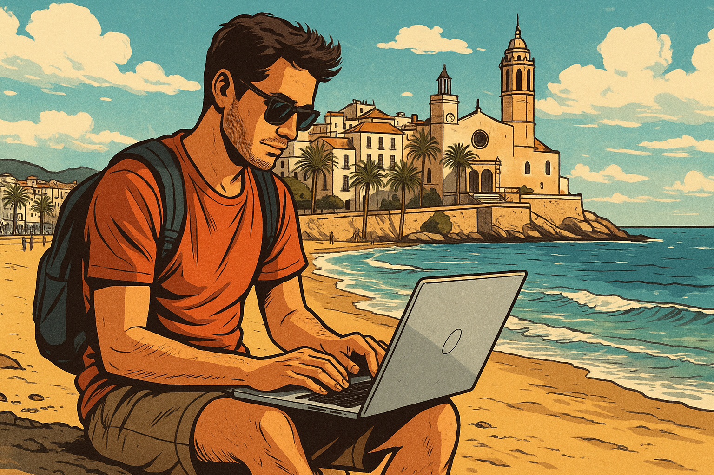
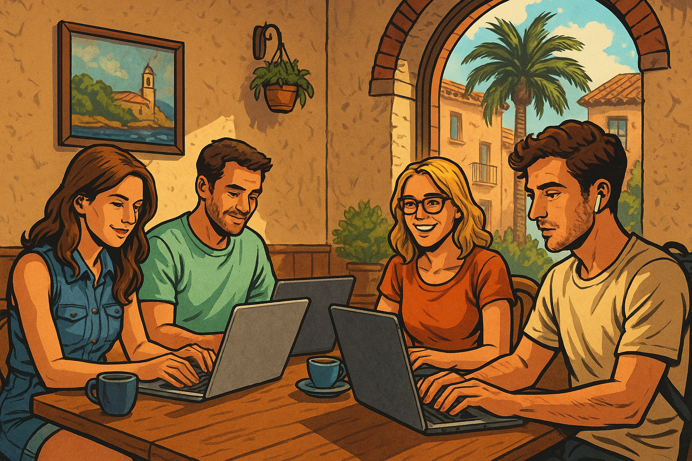

# Виза цифрового кочевника Испания: полный гайд по оформлению в 2025 году

## Что такое виза цифрового кочевника в Испанию?

Виза цифрового кочевника Испания (Digital Nomad Visa) – это специальное разрешение для удаленных работников, позволяющее легально жить и работать на территории королевства. Программа была запущена в декабре 2022 года, когда испанский парламент одобрил соответствующий закон в рамках программы "Ley de  Startups". С тех пор тысячи специалистов уже воспользовались этой возможностью для переезда в Испанию в 2025 году.

Виза цифрового кочевника Digital Nomad дает право на временное пребывание с возможностью выполнять рабочие задачи удаленно для работодателей или клиентов, расположенных за пределами Испании в стране их регистрации. Основное условие – получение основного дохода в размере 2762 евро от источников, не находящихся в Испании в 2025 году.

## Чем отличается от обычного ВНЖ

В отличие от стандартных видов на жительство, виза цифрового кочевника Digital Nomad имеет ряд существенных отличий:

- **Целевая аудитория.** Создана специально для удаленных работников, фрилансеров и предпринимателей.
- **Упрощенная процедура.** Более быстрое рассмотрение заявки (20 рабочих дней).
- **Налоговые льготы.** Доступ к специальному налоговому режиму (Закон Бекхэма для тех, кто в найме).
- **Отсутствие инвестиций.** Не требует никаких вложений в недвижимость или бизнес.
- **Возможность работать.** В отличие от нетрудовых ВНЖ (например, ВНЖ без права на работу).
- **Двойной формат.** Можно получить как визу через консульство, так и ВНЖ, находясь в Испании.

## Особенности Digital Nomad визы Испании

Испанская виза для цифровых кочевников имеет несколько уникальных характеристик, которые отличают её от аналогичных программ других стран:

- Один из самых длительных сроков пребывания среди подобных виз в Европе (3 года при подаче из Испании).
- Электронная подача документов через специальный портал при подаче с территории Испании.
- Четко установленные требования к уровню дохода, привязанные к минимальной зарплате в Испании.
- Официальный путь к получению ВНЖ в Испании, постоянному виду на жительство и возможность получить гражданство в перспективе.
- Льготное налогообложение для нерезидентов по Закону Бекхэма с фиксированным подоходным налогом.

## Преимущества визы цифрового кочевника

Выбор в пользу визы номада в Испании обосновывается рядом существенных преимуществ:

- **Длительный срок действия.** ВНЖ выдается сразу на 3 года при подаче из Испании или на 1 год через консульство.
- **Путь к ПМЖ и гражданству.** Годы проживания по этому статусу учитываются для получения постоянного вида на жительство (через 5 лет) и, при желании, гражданства.
- **Семейное воссоединение.** Возможность взять с собой супругов, гражданских партнеров, детей и даже ближайших родственников.
- **Право на работу.** Совершеннолетние члены семьи получают право вести трудовую деятельность в Испании.
- **Налоговые льготы.** Специальный налог на доходы с фиксированной ставкой 24 % в первые 4 года.
- **Свобода передвижения.** Возможность путешествовать по всей шенгенской зоне без дополнительных виз.
- **Доступ к испанской системе здравоохранения.** После регистрации в фонде социального страхования.
- **Быстрое рассмотрение заявки.** 20 рабочих дней по закону с возможностью автоматического одобрения при отсутствии дополнительных запросов.

## Почему стоит выбрать Испанию для релокации?

### Тёплый климат

Испания славится своим благоприятным средиземноморским климатом с более чем 300 солнечными днями в году во многих регионах. Комфортные температуры даже зимой (особенно на побережье и островах) делают страну привлекательной для людей, которые ценят хорошую погоду. Разнообразие климатических зон – от средиземноморского побережья до горных районов – позволяет выбрать наиболее подходящие условия.

### Свобода перемещения по Европе

Испанский ВНЖ открывает доступ ко всему Шенгенскому пространству. Вы можете свободно путешествовать по 27 странам, в которых действует соглашение, без дополнительных виз. Это идеальная база для регулярных поездок по Европе – от Португалии до Финляндии, от Италии до Франции и других государств шенгенской зоны.

### Престижное образование

Испанская система образования предлагает высококачественное обучение для детей и взрослых. В стране представлены как государственные, так и международные школы с преподаванием на разных языках. Университеты Испании, такие как IE Business School и Universidad de Barcelona, входят в мировые рейтинги лучших учебных заведений.

### Стабильная экономика

Испания – четвёртая экономика Еврозоны с развитой инфраструктурой и благоприятной бизнес-средой. Страна активно привлекает высококвалифицированных специалистов и инвестиции, развивает инновационные сектора экономики. Стабильная политическая система и членство в ЕС обеспечивают дополнительную надёжность.

### Приветливые жители

Испанцы известны своим дружелюбием, открытостью и гостеприимством. Местные жители легко идут на контакт и помогают иностранцам адаптироваться. Многообразие культур и большие экспатские сообщества создают комфортную среду для новоприбывших из разных стран.

### Закон Бекхэма и налоговые льготы

Испания предлагает специальный налоговый режим для новых налоговых резидентов (Ley Beckham), которым могут воспользоваться обладатели визы цифрового кочевника Digital. Этот режим позволяет платить фиксированную ставку 24 % вместо прогрессивной шкалы подоходного налога (до 47 %) в течение всего первого четырёхлетнего периода пребывания.

## Кому подходит Digital Nomad Visa Испания?

- **Гражданам стран вне ЕС.** Виза цифрового кочевника Digital предназначена исключительно для граждан стран, не входящих в Европейский Союз.
- **Фрилансерам.** Самозанятые специалисты, оказывающие услуги клиентам за пределами Испании, являются идеальными кандидатами.
- **Удалённым сотрудникам.** Сотрудники зарубежных компаний, работающие в удалённом формате, могут легально переехать в Испанию.
- **Владельцам бизнеса.** Предприниматели, чей бизнес не требует постоянного физического присутствия и зарегистрирован за пределами Испании более 1 года.

## Основные требования для получения визы цифрового кочевника в Испанию

### Доход (минимальная сумма дохода)

Требования по испанской программе Digital Nomad Visa регламентируют минимальный ежемесячный доход, который необходимо подтвердить:

- 2763 € — на одного основного заявителя (200 % от минимальной зарплаты в Испании).
- 3799 € — на семью из двух человек.
- 4144 € — на семью из трёх человек.
- +345 € на каждого последующего члена семьи.

Указанные суммы отражают общий объём полученных денежных средств до уплаты налогов и актуальны на 2025 год.

### Доказательство удалённой работы

Необходимо предоставить убедительные доказательства того, что ваша работа может выполняться удалённо:

- Трудовой договор с иностранной компанией (для наёмных работников).
- Контракты на оказание услуг с иностранными клиентами (для фрилансеров).
- Документы о регистрации бизнеса за рубежом (для предпринимателей).

### Чистая судимость

Заявители должны иметь чистую криминальную историю за последние пять лет и предоставить справку об отсутствии судимости из всех стран, где они проживали более 6 месяцев за последние 2 года. Дополнительно требуется подписать декларацию о несудимости за последние 5 лет.

### Медицинская страховка

Заявители должны иметь полис медицинского страхования с полным покрытием на территории Испании на весь период действия ВНЖ. Страховка должна быть без франшизы и периодов ожидания.

### Финансовые гарантии

Если регулярного дохода недостаточно, можно подтвердить наличие накоплений на банковском счёте:

- Для основного заявителя: примерно 30 240 € на 2 года.
- Для первого члена семьи: 11 340 € × 2 = 22 680 €.
- Для каждого последующего члена семьи: 3 780 € × 2 = 7 560 €.

### Перечень необходимых документов

Для получения визы цифрового кочевника потребуется подготовить следующий список документов:

- Договор на работу/услуги с компанией вне Испании (заключённый не менее 3 месяцев назад).
- Банковские выписки за последние 3 месяца.
- Документ о регистрации компании-работодателя/клиента (который должен существовать более года).
- Письмо от работодателя с разрешением на удалённую работу.
- Подтверждение образования или 3-летнего опыта работы.
- Документы о социальном страховании.
- Медицинская страховка.
- Справка об отсутствии судимости.
- Загранпаспорт (все страницы).
- Анкета (форма MIT) для основного заявителя.
- Квитанция об оплате пошлины.

### Документы для членов семьи

Для включения членов семьи в заявку дополнительно потребуются:

- Свидетельство о браке или документ о партнёрстве.
- Свидетельство о рождении для детей.
- Декларация о браке/партнёрстве.
- Справка об отсутствии судимости для совершеннолетних.
- Загранпаспорт каждого члена семьи.
- Анкета MIF для членов семьи.
- Квитанция об оплате пошлины за каждого члена семьи.

### Какие документы должны быть переведены на испанский язык

Документы делятся на две категории по типу перевода:

**Требующие официального перевода (от присяжного переводчика):**

- Трудовой договор/контракт на услуги.
- Документ о регистрации компании.
- Диплом/документы о 3-летнем опыте работы.
- Справка об отсутствии судимости.
- Свидетельства о браке/рождении.
- Документ о социальном страховании.

**Допускающие самостоятельный перевод:**

- Банковские выписки.
- Письмо от работодателя.
- Резюме.
- Декларации и анкеты.

### Подтверждение дохода

Для подтверждения финансовой состоятельности необходимо предоставить:

- Банковские выписки за последние 3 месяца с указанием поступлений.
- Инвойсы или акты выполненных работ (желательно).
- Выписка должна содержать печать банка или её изображение.
- При недостаточном доходе – выписку о наличии сбережений.

### Документы по трудоустройству или бизнесу

Для наёмных работников:

- Трудовой договор (с указанием должности, зарплаты и возможности удалённой работы).
- Письмо-разрешение на удалённую работу из Испании.
- Документ из фонда социального страхования о продолжении страхования.

Для фрилансеров/ИП:

- Контракты с клиентами.
- Регистрация ИП (если применимо).
- Письмо с обязательством зарегистрироваться в испанской системе соцстраха.

## Как подать на визу цифрового кочевника в Испанию

### Подача документов находясь в Испании (по туристической визе)

Этот вариант позволяет получить ВНЖ сразу на 3 года и рекомендуется как наиболее удобный:

1. Въехать в Испанию по туристической визе или безвизовому режиму.
2. Получить штамп о въезде или оформить декларацию о въезде (в течение 3 дней).
3. Подготовить комплект документов.
4. Подать заявление онлайн через портал UGE (электронная подача).
5. Получить решение в течение 20 рабочих дней.
6. После одобрения записаться на сдачу отпечатков пальцев для получения карточки резидента (TIE).

Преимущества: более длительный срок ВНЖ, меньше формальностей с документами, быстрее рассмотрение.

### Подача документов из своей страны

Альтернативный вариант – получение визы D через консульство Испании:

1. Получить NIE (идентификационный номер иностранца).
2. Запись на подачу документов в консульство.
3. Подготовить полный комплект документов.
4. Лично подать заявление в консульстве.
5. Получить визу на 1 год.
6. После въезда в Испанию можно трансформировать визу в ВНЖ на 3 года.

### Пошаговый процесс получения Digital Nomad Visa

1. Сбор необходимых документов.
2. Оформление/перевод трудового договора или контрактов с клиентами.
3. Получение справки о несудимости с апостилем.
4. Заказ медицинской страховки.
5. Получение выписок из банка.
6. Оформление документа о социальном страховании.
7. Заполнение анкет и деклараций.
8. Подготовка скана всех страниц паспорта.
9. Получение NIE.

При подаче через консульство:

- Заполнение формы EX‑15.
- Отправка запроса по электронной почте в консульство.
- Ожидание присвоения номера (6–8 недель).

При подаче из Испании NIE присваивается автоматически в процессе рассмотрения заявки.

### Подача заявления на визу

Через консульство:

- Запись на подачу в консульстве.
- Личное посещение с полным комплектом документов.
- Оплата консульских сборов.
- Ожидание результата рассмотрения и отслеживание статуса заявления.

После одобрения в консульстве:

- Получение годовой визы D.
- Въезд в Испанию в указанные сроки.
- Получение TIE (карты резидента).

Подача из Испании:

- Подготовка документов в электронном виде (PDF).
- Регистрация на портале UGE.
- Заполнение онлайн-формы.
- Загрузка документов (максимальный размер — 24 МБ).
- Оплата пошлины (73,26 евро за каждого заявителя).
- Отправка заявления с помощью электронной цифровой подписи.
- Запись на сдачу биометрических данных (в течение месяца).
- Сдача отпечатков пальцев.
- Ожидание изготовления карты (около 1–2 недель).
- Получение карты резидента (TIE) на 3 года.
- Регистрация по месту жительства (empadronamiento).

## Сколько стоит ВНЖ цифрового кочевника в Испании?

### Официальные сборы

- Пошлина за рассмотрение заявления: 73,26 € за каждого заявителя.
- Выпуск карточки резидента (TIE): около 15–20 €.
- Консульский сбор (при подаче через консульство): около 80–100 €.

### Стоимость оформления через агентства

- Базовая консультация: от 50 до 150 €.
- Проверка документов: от 100 до 300 €.
- Частичное сопровождение: от 300 до 800 €.
- Полное сопровождение под ключ: от 800 до 2500 €.

### Тарифы на услуги сопровождения

Большинство агентств предлагают пакеты услуг:

- **Базовый пакет (от 300 €).** Консультация, проверка документов, список рекомендаций.
- **Стандартный пакет (от 800 €).** Консультация, подготовка и проверка документов, заполнение анкет, сопровождение процесса подачи.
- **Премиум пакет (от 1500 €).** Все услуги стандартного пакета, организация переводов и апостилей, подбор медицинской страховки, помощь с регистрацией в гос. органах.

## Налоги для цифровых кочевников в Испании

### Налоговые ставки

Владельцы визы цифрового кочевника могут выбрать между:

- **Специальный режим по Закону Бекхэма.**
  - Фиксированная ставка 24 % на доходы до 600 000 €.
  - 47 % на доходы свыше 600 000 €.
  - Действует первые 4 года налогового резидентства.

- **Стандартная прогрессивная шкала налога на доходы.**
  - До 12 450 €: 19 %.
  - 12 450–20 200 €: 24 %.
  - 20 200–35 200 €: 30 %.
  - 35 200–60 000 €: 37 %.
  - 60 000–300 000 €: 45 %.
  - Свыше 300 000 €: 47 %.

### Особенности налогообложения в Испании

- Налоговым резидентом становятся после пребывания в Испании более 183 дней в году.
- Налоговые декларации подаются с апреля по июнь следующего года.
- Существуют налоговые вычеты на аренду жилья, инвестиции в бизнес и другие расходы.
- НДС в Испании (IVA) составляет 21 % на большинство товаров и услуг.

### Закон Бекхэма

- Доступен новым налоговым резидентам, включая обладателей визы цифрового кочевника Digital Nomad.
- Не облагаются налогом доходы, полученные за пределами Испании (с некоторыми ограничениями).
- Необходимо подать заявление на получение этого статуса в течение 6 месяцев после получения статуса налогового резидента.

### Налогообложение в России при жизни за границей

- При сохранении налогового резидентства России (более 183 дней в РФ) – обязанность декларировать все мировые доходы.
- При утрате налогового резидентства – обязанность декларировать только доходы из российских источников.
- Контролируемые иностранные компании (КИК) – отдельные правила декларирования для владельцев бизнеса.
- С 2023 года – добровольный взнос для сохранения налогового статуса (5 млн рублей в год).

### Как избежать двойного налогообложения

- Между Испанией и Россией действует соглашение об избежании двойного налогообложения.
- При смене налогового резидентства можно избежать уплаты налогов дважды.
- Нерезиденты России платят налог только с доходов из российских источников.

## Виза кочевника для семьи

### Подача на членов семьи

Виза цифрового кочевника Digital позволяет включить в заявление:

- Супруга/супругу (официальный брак).
- Гражданского партнёра (при оформлении партнёрства).
- Детей (несовершеннолетних и взрослых на иждивении).
- Ближайших родственников (при определённых условиях).

### Финансовые требования на семью

- Основной заявитель: 2763 €.
- Семья из 2 человек: 3799 €.
- Семья из 3 человек: 4144 €.
- За каждого следующего члена семьи: +345 €.

### Права и возможности для членов семьи в Испании

- Совершеннолетние члены семьи имеют право вести трудовую деятельность в Испании.
- Доступ к системе образования для детей.
- Доступ к медицинскому обслуживанию.
- Возможность путешествовать по шенгенской зоне.
- Накопление срока для получения постоянного вида на жительство с типом larga duración.

## Срок действия и продление Digital Nomad Visa

### Срок действия визы

- При подаче из Испании: ВНЖ выдаётся на 3 года или на срок трудового договора (если он меньше 3 лет).
- При подаче через консульство: виза D выдаётся на 1 год с возможностью трансформации в ВНЖ после приезда.

### Условия продления

- Сохранение трудовых отношений с зарубежными работодателями/клиентами.
- Поддержание требуемого уровня дохода.
- Отсутствие нарушений иммиграционного законодательства.
- Фактическое проживание в Испании (не менее 6 месяцев в году).

### Процесс продления

- Подача заявления на продление не позднее 60 дней до окончания срока действия текущего ВНЖ.
- Подготовка обновлённого комплекта документов.
- Подача через тот же электронный портал.
- Получение решения в течение 20 рабочих дней.
- Обновление карты резидента (TIE).

После первых 3 лет можно будет продлить статус ещё на 2 года.

## Получение ПМЖ и гражданства Испании через Digital Nomad Visa

### Путь от визы к постоянному виду на жительство

После истечения пятилетнего срока заявитель имеет право подать заявление на получение ПМЖ, при соблюдении условий:

- Непрерывное легальное проживание в Испании в течение 5 лет.
- Фактическое нахождение в стране не менее 183 дней в году.
- Отсутствие судимостей и нарушений закона.
- Подтверждение финансовой состоятельности.
- Наличие жилья (собственного или арендованного).
- Отсутствие дополнительных запросов со стороны миграционных органов.

### Получение гражданства через 10 лет

- Легально прожить в Испании 10 лет (для большинства стран).
- Сдать экзамен по испанскому языку (уровень DELE A2).
- Сдать экзамен на знание конституции и культуры (CCSE).
- Отказаться от предыдущего гражданства (для большинства стран).
- Пройти проверку на судимость и интеграцию в общество.

Для граждан некоторых стран (бывших колоний Испании) срок может составлять около 2 лет.

## Проблемы и подводные камни

### Частые причины отказа

- Недостаточный уровень дохода.
- Несоответствие договора требованиям.
- Недостоверные сведения.
- Неполный комплект документов.
- Проблемы с социальным страхованием.
- Отсутствие апостиля.
- Наличие судимости или проблемы с правоохранительными органами.

### Как преодолеть бюрократические сложности

- Заблаговременная подготовка (2–3 месяца до подачи).
- Консультация со специалистами.
- Двойная проверка документов.
- Использование доверенных переводчиков.
- Запрос дополнительных документов при сомнениях.
- Обращение в сообщества цифровых кочевников.

### Как избежать ошибок при подаче

- Чёткое следование инструкциям.
- Корректное заполнение анкет.
- Правильный формат документов.
- Своевременная оплата пошлин.
- Соответствие переводов оригиналам.
- Проверка сроков действия справок, страховок и других документов.

## Плюсы и минусы Digital Nomad Visa в Испанию

### Преимущества программы

- Длительный срок действия.
- Налоговые льготы.
- Свобода передвижения.
- Семейное воссоединение.
- Право на работу для членов семьи.
- Путь к ПМЖ и гражданству.
- Быстрое рассмотрение.
- Предсказуемые требования.

### Возможные недостатки

- Требования к доходу.
- Сложность подготовки документов.
- Обязательное социальное страхование.
- Налоговое резидентство.
- Языковой барьер.
- Необходимость физического присутствия (6 месяцев).
- Ограничения на работу с местными компаниями.

## Жизнь в Испании для цифровых кочевников

### Стоимость жизни

- **Аренда жилья:** Мадрид/Барселона — от 800 €; средние города 500–700 €; небольшие города от 350 €.
- **Коммунальные платежи:** 80–150 €.
- **Интернет:** 30–50 €.
- **Продукты:** 200–300 € на человека.
- **Транспорт:** 30–60 €.
- **Развлечения и досуг:** от 150 €.
- **Медицинская страховка:** от 50 €.

Общие минимальные расходы составляют около 1200 € на человека в месяц в небольших городах и от 1800 € в Мадриде/Барселоне.

### Лучшие города для жизни цифровых кочевников

- **Барселона:** развита инфраструктура для удалённой работы, множество коворкингов и активное сообщество экспатов.
- **Мадрид:** богатая культурная жизнь, высокое качество жизни и хорошее транспортное сообщение.
- **Валенсия:** более доступные цены, отличный климат, пляжи и развитая инфраструктура.
- **Малага:** быстро развивающийся технологический хаб на побережье Коста-дель-Соль.
- **Аликанте:** доступное жильё, хороший климат и прямые авиарейсы во многие европейские города.
- **Канарские острова:** круглогодичное лето, развивающиеся хабы для удалённой работы.
- **Балеарские острова:** отличная инфраструктура и уникальный образ жизни.

### Здравоохранение

- Государственная система доступна после регистрации в фонде социального страхования Испании.
- Частная медицина: высокое качество услуг при относительно невысокой стоимости.
- Медицинское страхование обязательно.
- Аптеки: широкая сеть с доступными ценами на лекарства.

### Открытие банковского счёта

- Необходимые документы: NIE, загранпаспорт, подтверждение адреса.
- Популярные банки: CaixaBank, BBVA, Santander, Sabadell, ING.
- Онлайн-банки: N26, Revolut, Wise.
- Комиссии: от 0 до 20 €.
- Мобильный банкинг: качественные мобильные приложения.

### Часто задаваемые вопросы

**Можно ли перевезти семью?**

Да, виза цифрового кочевника Digital позволяет включить супругов, детей и ближайших родственников.

**Какой доход нужен?**

В 2025 году минимальный доход составляет 2763 € на основного заявителя, 3799 € на двоих, 4144 € на троих, +345 € за каждого следующего.

**Что делать в случае отказа?**

Исправить причины отказа и подать документы повторно, подать апелляцию или рассмотреть альтернативные ВНЖ.

**Сколько длится рассмотрение заявки?**

Официальный срок — 20 рабочих дней. При подачи через консульство — от 1 до 3 месяцев.

## Помощь в получении Digital Nomad Visa

Наша команда предлагает полное сопровождение оформления, включая:

- Анализ ситуации и подбор решения.
- Подготовка и проверка документов.
- Организация переводов и апостилей.
- Заполнение анкет и подача документов.
- Взаимодействие с государственными органами.
- Поддержка на всех этапах до получения карты резидента.

**Индивидуальная стратегия.** Мы разрабатываем персональную стратегию оформления, учитывая вашу ситуацию.

**Бесплатная оценка шансов.** Эксперт анализирует соответствие требованиям, проверяет документы и оценивает вероятность одобрения.

**Удобная оплата в три этапа.** 30 % после консультации, 40 % после подготовки документов, 30 % после получения решения.

**Почему выбрать нашу команду?** Мы работаем с программой цифровых кочевников с 2022 года, имеем более 300 успешных кейсов и предлагаем гарантию результата.

**Отзывы клиентов.** Положительные отзывы подтверждают нашу репутацию.

**Сообщество цифровых кочевников в Telegram.** Присоединяйтесь к сообществу для получения актуальной информации и поддержки.

## Заключение

Виза цифрового кочевника в Испанию предоставляет уникальную возможность для удалённых работников легально переехать в европейскую страну с высоким качеством жизни. Программа отличается чёткими требованиями, предсказуемыми сроками рассмотрения и длительным сроком действия, что делает её одной из самых привлекательных для цифровых кочевников. Даже если у вас уже есть опыт работы на рынке труда менее 3 лет, вы можете подать заявление, если соответствуете остальным требованиям.

**Следующие шаги:**

1. Проверьте соответствие требованиям.
2. Начните сбор документов (особенно тех, что требуют апостиля).
3. Получите бесплатную консультацию.
4. Определите способ подачи (консульство или подача из Испании).
5. Подготовьте финансовую базу.
6. Начните изучать испанский язык.
7. Присоединитесь к сообществу цифровых кочевников.

**Остались вопросы?**

Запишитесь на бесплатную консультацию. Контакт: [Telegram](https://t.me/viza_cifrovogo_kochevnika_ispana).

Испания ждёт вас – сделайте первый шаг к новой жизни уже сегодня!
