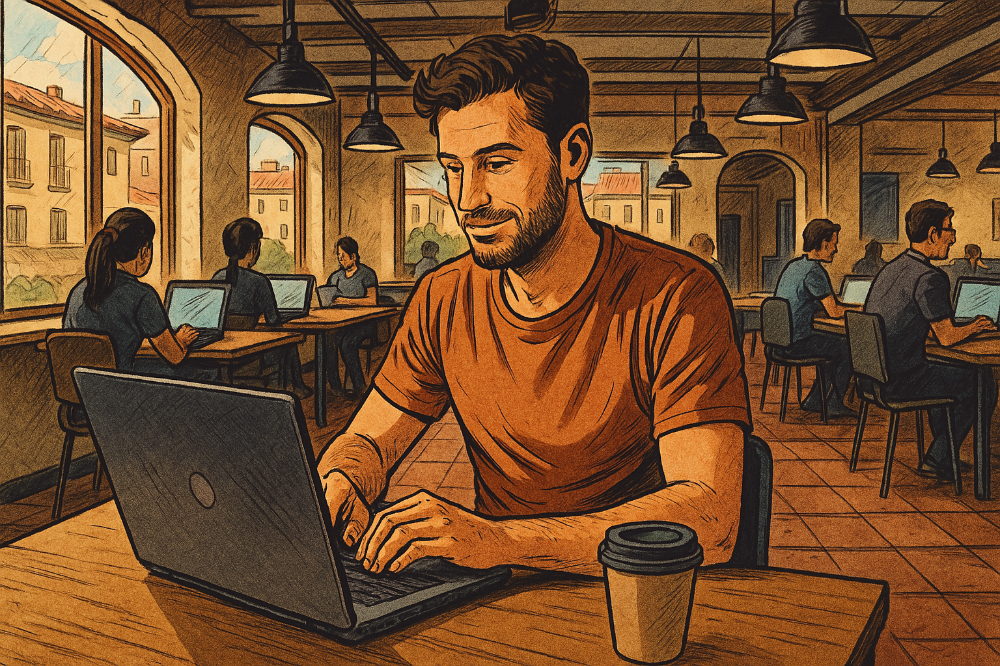
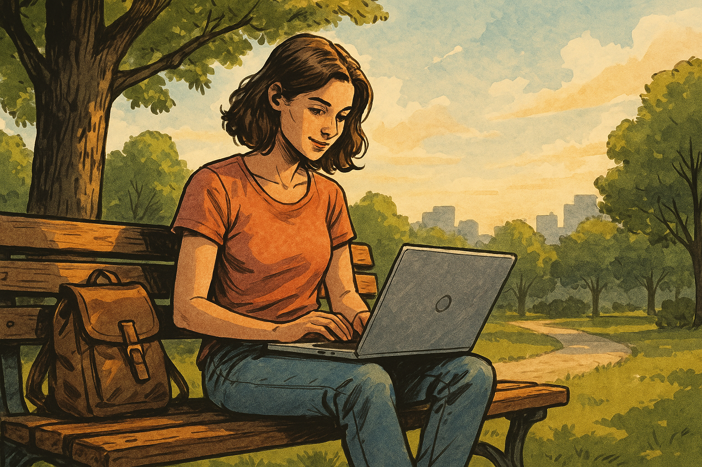

# Испанская цифровая номад‑виза в 2025 году: полный гид для удалённых специалистов

## Введение

Ипания стала одной из первых стран Европы, которая официально **приняла закон о цифровых кочевниках**. Программа стартовала в декабре 2022 года в рамках !«Стартап‑акта»* и даёт возможность приезжать, легально жить и работать удалённо на солнечных берегах Пиренейского полуострова. Для этого оформляется специальная **digital nomad‑visa** (телеработа), предназначенная для граждан третьих стран, которые трудятся на компании за пределами Испании. В этой статье мы проведём вас через каждую деталь: разберём, кто может претендовать на новую визу, какие требования предъявляются к доходу и квалификации, как подавать документы, сколько составляет пошлина, а также какие права и обязанности появляются у обладателя статуса.

## Кто может претендовать на цифровую номад‑визу

Согласно испанскому консульству, **виза телеработника предназначена для иностранцев**, которые выполняют свою профессиональную деятельность дистанционно через интернет для компаний, расположенных *за пределами Испании*. Она не применяется к гражданам Евросоюза и Европейской экономической зоны. Рассмотрим основные критерии:

- **Удалённые наёмные сотрудники.** Работодатель должен находиться вне Испании, а компания должна существовать не менее года. Работник обязан проработать в этой компании не менее трёх месяцев и получить разрешение работодателя на дистанционную работу из Испании. Более 80 % дохода должно поступать из‑за рубежа; работа на испанские фирмы запрещена.
- **Самозанятые и фрилансеры.** Такие специалисты могут работать на клиентов по всему миру и даже заключать контракты с испанскими компаниями, однако доход от испанских заказчиков **не должен превышать 20 % общей выручки**. Контракт с зарубежным заказчиком должен действовать минимум год.
- **Квалифицированные профессионалы.** Необходимо подтвердить высшее образование, диплом профессиональной подготовки или наличие **минимум трёх лет стажа** в своей области. Это могут быть копии дипломов, сертификаты, рекомендательные письма, CV.
- **Члены семьи.** Получатели визы могут привезти с собой супруга (или партнёра), детей и родителей, если те финансово зависят от заявителя. Для каждого сопровождающего действует дополнительное требование по доходу (75 % для первого члена семьи и 25 % для каждого последующего).
- **Легально находящиеся в Испании.** Если вы уже приехали в страну по туристической или другой визе, вы имеете право **подать заявку на телеработу внутри Испании** и сразу получить разрешение на проживание сроком до трёх лет. Это удобно для тех, кто хочет сначала познакомиться со страной.

Вне зависимости от категории, любой заявитель должен быть старше 18 лет, иметь чистую судимость и не числиться в шенгенском стоп‑листе.

## Требования к доходу и финансовые критерии

Испанская цифровая nomad‑виза требует доказательства финансовой независимости. Минимальный доход к 2025 году **равен 200 % от размера испанского минимального заработка (SMI)** — то есть **не менее €2 762,66 в месяц**. При наличии семьи сумма увеличивается: плюс 75 % минимального дохода на первого иждивенца (≈€1 035) и 25 % на каждого следующего (≈€346). Источники дохода могут быть следующие:

- **Заработная плата.** Предоставьте трудовой договор и последние три месяца платежных ведомостей. Работодатель должен подтвердить, что вы можете работать удалённо и что компания существует минимум год.
- **Фриланс‑контракты.** Укажите количество заказчиков, приложите контракты и выписки по счёту. При необходимости можно показать несколько договоров, чтобы сумма превышала установленный минимум.
  **Пассивный доход.** Если ваши средства поступают из ренты, процентов или инвестиций, нужно доказать, что общая сумма не падает ниже минимального уровня. В некоторых случаях достаточно показать сбережения за последние 12 месяцев — например, 24 тыс. € на банковском счёте.
- **Свидетельства о выплате налогов.** Для юридических лиц или ИП могут потребоваться выписки из реестра, подтверждающие регулярные отчисления и отсутствие задолженностей.

Важно помнить: снижение дохода ниже порога может стать основанием для отказа в продлении визы. Поэтому заранее оцените, чем закончится сотрудничество с основными заказчиками, и подумайте о резервном источнике средств.

## Какие документы потребуются

Список документов для оформления визы или получения резиденции соответствует консульским требованиям. Чтобы не пропустить важную деталь, приготовьте:

1. **Анкету.** Заполните национальную визовую анкету (форму можно скачать на сайте консульства). В пункте «адрес» укажите испанский адрес (может быть бронирование отеля или аренда квартиры) и **NIE** – иностранный идентификационный номер.
2. **Фотографии.** Нужны две цветные фотографии паспортного формата, сделанные на белом фоне, без очков и головных уборов.
3. **Действительный загранпаспорт.** Срок действия паспорта должен покрывать период предполагаемого пребывания; требуется как оригинал, так и копии страниц с биоданными.
4. **Справка о несудимости.** Требуется для всех стран, где вы проживали более шести месяцев за последние пять лет. Документ должен быть переведён на испанский язык и апостилирован.
5. **Доказательство места жительства.** Для подачи за границей понадобится документ о проживании в стране подачи, например, вид на жительство или рабочая виза. В России заявки принимают визовые центры в Москве и Санкт‑Петербурге — адрес зависит от прописки.
6. **Документы, подтверждающие занятость.** Для сотрудников — письмо от работодателя с информацией о сроке работы (как минимум 3 месяца) и разрешением трудиться удалённо. Для фрилансеров — контракт(ы) с заказчиками и описание условий удалённой работы.
7. **Квалификация.** Копии дипломов, сертификатов, лицензий или иных доказательств профессиональной квалификации и стажа.
8. **Медицинская страховка.** Необходимо оформить частную страховку, действующую в Испании и покрывающую весь период пребывания (она должна покрывать претендентов и членов семьи). Помимо приватной, цифровые кочевники могут пользоваться системой Seguridad Social, если встали на учёт как самозанятые.
9. **Банковские выписки.** Подтверждают наличие необходимого дохода или сбережений.
10. **Оплата пошлины.** Консульский сбор составляет около **€80**. Оплатить госпошлину можно через консульство, а затем приложить чек или квитанцию.

Большинство бумаг нужно переводить на испанский язык и заверять у нотариуса. В отдельных случаях могут запросить дополнительные копии или справки, поэтому следите за списком документов на сайте вашего визового центра.

## Процедура подачи заявления

### Где подавать и когда

Подача документов на цифровую nomad‑визу может происходить **дистанционно** либо через визовый центр. В зависимости от того, где вы находитесь, алгоритм будет различаться:

- **За пределами Испании.** Подайте заявление в консульство по месту проживания. Россияне, например, обращаются в визовые центры **в Москве или Санкт‑Петербурге**, в зависимости от прописки.
- **Внутри Испании.** Если вы легально въехали по шенгенской визе, туристическому безвизовому режиму или студенческой визе, вы можете обратиться напрямую в **офис UGECE** (Unidad de Grandes Empresas y Colectivos Estratégicos) или нанять представителя, который заполнит документы через электронную подпись. Такой вариант позволяет оформить **резиденцию** сразу на 3 года и продлевать её на аналогичный срок.

### Шаги подачи

1. **Соберите пакет документов.** Используйте чек‑лист, чтобы не забыть ни одной справки. При необходимости попросите нотариуса заверить копии и сделать переводы.
2. **Заполните анкету.** Это можно сделать на сайте консульства; потребуется указать персональные данные, CV, даты въезда, адрес проживания в Испании, све
3. дения о работодателе и пр.
4. **Запросите appointment в визовом центре.** Запись на приём осуществляется заранее; сроки ожидания могут отличаться. В некоторых странах доступна подача документов через почту.
5. **Оплатите пошлину.** Консульский сбор обычно равен €80; иногда может потребоваться отдельный платёж за апостиль или услуги перевода.
6. **Посетите интервью.** На приёме вам нужно будет лично подать документы, сфотографироваться и сдать отпечатки пальцев. В некоторых странах биометрию можно сдать в отдельном центре.
7. **Ожидайте решение.** Стандартный **срок рассмотрения** составляет **15–45 дней**. Консульство может запросить дополнительные сведения или корректировки.

Имейте в виду: несмотря на то что подача документов происходит онлайн, всё равно **нужно показать легальное нахождение в Испании** в момент подачи заявления. Если срок действия вашей визы истекает, выезжайте до получения разрешения — иначе могут отказать.

## Продление и получение вида на жительство

Цифровая номад‑виза выдается на **один год** с возможностью продления ещё на четыре года — таким образом, суммарный срок действия может составить пять лет. По истечении первой визы вы можете подать заявление на **долгосрочный вид на жительство (residencia) на три года**. Основные моменты:

- **Соблюдение сроков.** Заявку на продление подают не ранее чем за 60 дней и не позднее дня истечения срока действия визы.
- **Подтверждение дохода.** Требования сохраняются: минимальный доход должен превышать 200 % SMI. Если вы планируете привезти родителей или второе поколение, доход увеличивается в зависимости от количества иждивенцев.
- **Постоянное проживание.** Для получения постоянной резиденции необходимо прожить в Испании не менее пяти лет, соблюдая правило пребывания: **минимум 6 месяцев в году**, иначе счётчик обнуляется.
- **Гражданство.** Через пять лет можно претендовать на ПМЖ, а через десять — на гражданство.

## Налоги, страховка и социальное обеспечение

У владельцев цифровой nomad‑визы появляется ряд финансовых и налоговых обязанностей. Рассмотрим основные:

### Налогообложение и социальные взносы

- **Налоговая резиденция.** Если вы проживаете в Испании более 183 дней в году, вы становитесь налоговым резидентом и должны платить подоходный налог (IRPF). Однако существует льготный режим для новых резидентов: доход до €600 000 облагается по ставке **24 %**.
- **Двойное налогообложение.** Испания заключила соглашения об избежании двойного налогообложения с более чем 90 странами, поэтому уплаченные за рубежом налоги засчитываются.
- **Seguridad Social.** Самозанятые лица обязаны зарегистрироваться и уплачивать ежемесячные взносы в систему социального обеспечения (cuota de autónomo). Наёмные сотрудники продолжают платить отчисления в стране работодателя, но могут воспользоваться местной системой медстрахования.
- **Пассивный доход.** Если вы хотите воспользоваться нерабочей резиденцией (non‑lucrative visa), потребуется пассивный доход не менее €27 115,20 в год.

### Медицинская страховка

Для подачи заявления и продления статуса нужна **частная страховая программа** с покрытием без франшизы. Некоторые компании, такие как Sanitas или Adeslas, предлагают полисы для экспатов; у Sanitas есть русскоязычные агенты, которые помогут оформить договор.

## Жизнь и работа в Испании: практические советы

Испания предлагает богатую культуру, мягкий климат и развитую инфраструктуру для цифровых кочевников. Чтобы адаптация прошла комфортно:

- **Выбор города.** Многие выбирают Барселону или Мадрид, где много коуоркингов и стартап‑сообществ. В Валенсии и Малаге стоимость жизни ниже, а климат мягче. Важно учитывать, что в Мадриде и Барселоне возможно больше бюрократии и задержек из‑за нагрузки на миграционные службы.
- **Транспорт.** Если планируете часто пользоваться общественным транспортом, выгодно приобрести проездной. В пределах одного города проезд в метро и автобусах обычно не превышает €40–50 в месяц.
- **Языковые курсы.** Знание испанского языка облегчает общение и открывает новые возможности. Многие университеты и библиотеки проводят **курсы** для иностранцев; стоимость варьируется в зависимости от провайдера.
- **Банковский счёт.** Для оплаты аренды и коммунальных услуг лучше **открыть счёт в испанском банке**. Это ускорит переводы и уменьшит комиссии.
- **Аренда жилья.** Заключайте договор только после просмотра квартиры и убедитесь, что владелец законно сдаёт жильё. Некоторым владельцам потребуется сертификат неимения задолженностей или подтверждение финансовой состоятельности.
- **Качество жизни.** Испания славится здравоохранением, гастрономией и богатой историей. В свободное время можно путешествовать по стране — от пляжей Коста‑Бравы до горных трасс Сьерра‑Невады.

## Полезные ресурсы и контакты

- **Официальные источники.** Всегда проверяйте актуальную информацию на сайте консульства или Министерства включения, социального обеспечения и миграций. Там публикуются обновления законов, размер минимального дохода, список документов и сроки обработки.
- **Помощь юристов.** Если возникли сложности с подготовкой пакета документов, свяжитесь с профильным юристом. Опытные специалисты проведут вас через процедуру без задержек, помогут заполнить анкету, собрать копии и переводы.
- **Сообщества и блоги.** Многие цифровые кочевники ведут **блог** или канал на YouTube, где делятся опытом и сравнениями разных стран. Подписывайтесь на такие каналы, чтобы узнать о подводных камнях, ценах и нюансах жизни.
- **Мы готовы помочь.** Если вы хотите переехать в Испанию и стать резидентом, но не знаете, с чего начать — **свяжитесь с нами** через форму обратной связи. Мы расскажем, как подать заявку, с чем может быть связано увеличение времени обработки, и поможем подготовить все копии документов и CV.

## Заключение

Испанская цифровая nomad‑виза — это гибкий инструмент для тех, кто **работает удалённо** и хочет открыть для себя жизнь в Европе. Важно соблюдать требования: иметь стабильный доход, подтвердить профессиональную **квалификацию**, собрать обширный **пакет документов** и подать заявку в установленные **сроки**. Программа открыта для граждан **третьих стран**, и вместе с вами **в Испанию** могут приехать ваши **родители** или дети. Благодаря льготному налоговому режиму, мягкому климату и развитой инфраструктуре, Испания уже привлекла сотни инвесторов, фрилансеров и специалистов из **мира IT**.

Соблюдайте сроки подачи, **проверяйте политику конфиденциальности** на сайтах служб, где оставляете личные данные, и следите за изменениями в законодательстве. **Мы знаем**, как сложно бывает разобраться в бюрократии, но **проведём вас за руку** через все этапы оформления. Желаем удачи и ждём, когда вы поделитесь своим опытом в комментариях!
